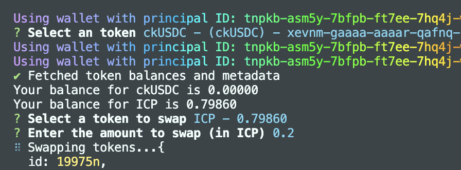
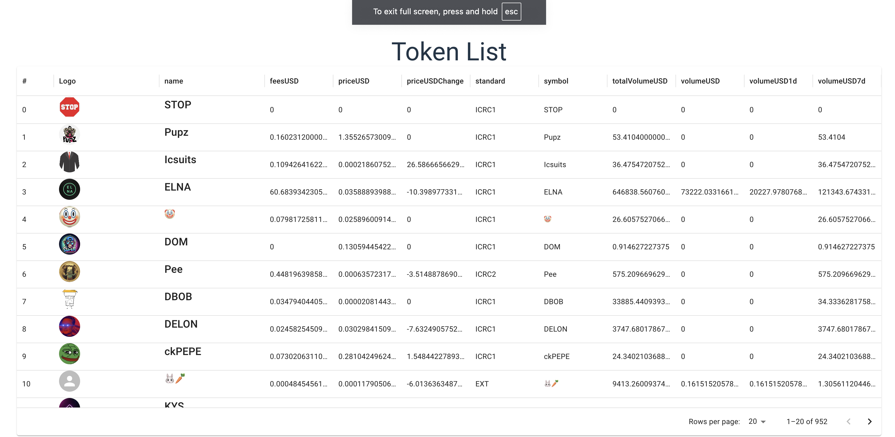

### Install

```
npm install @rainbow-ic/sunbeam
```

### Before running

put wallet seed to execute swap

stoic wallet compatible

```
SEED=
```

### Swap example with terminal swap



[source code](src/cli.ts)

[video demo](https://youtu.be/CpMjEedSA3A)

### List token frontend


[source code](https://github.com/rainbow-ic/sunbeam-example/blob/main/src/frontend/demo-table)
